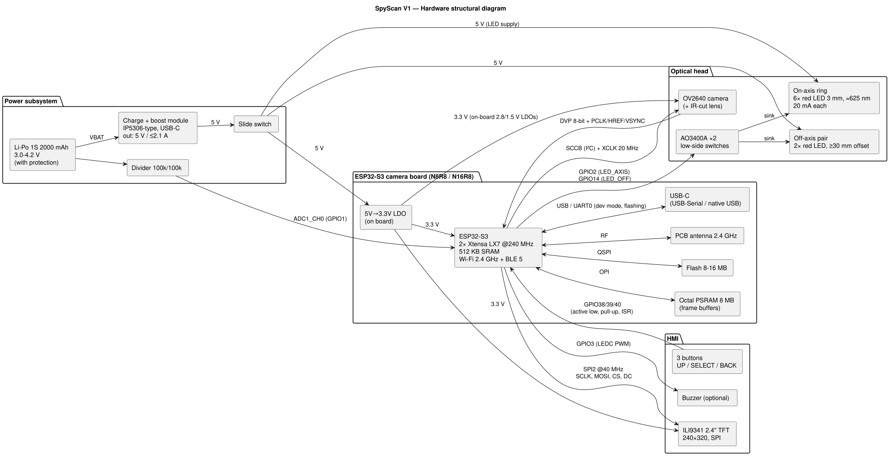
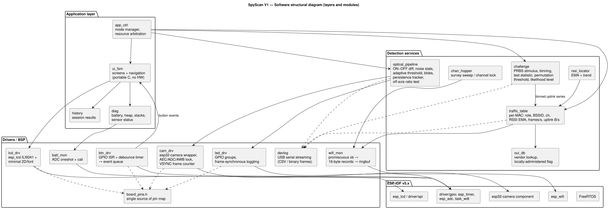
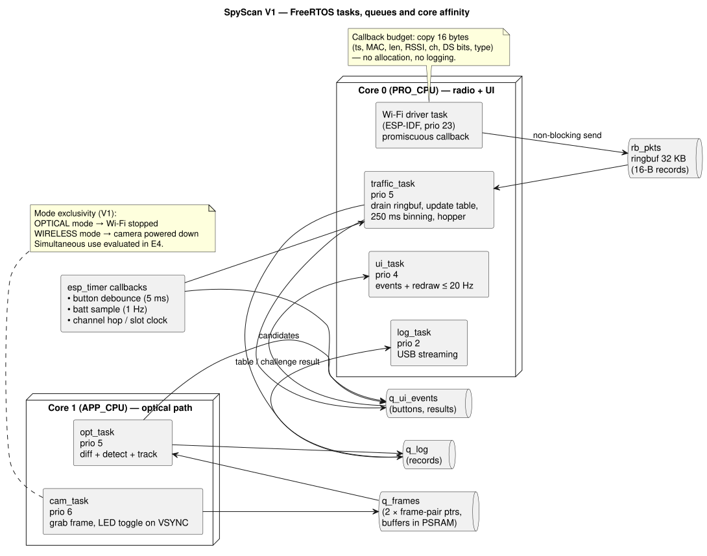
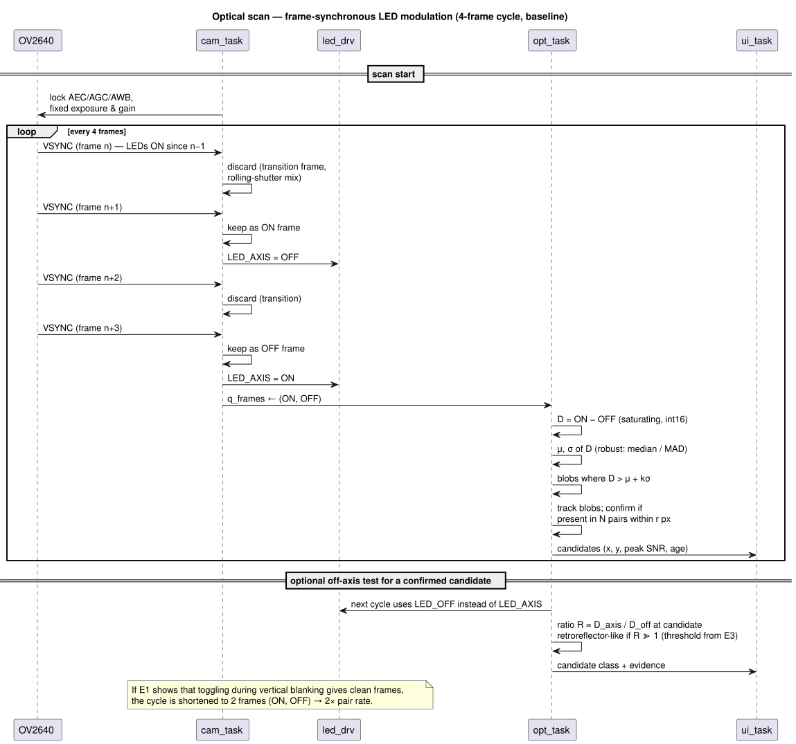
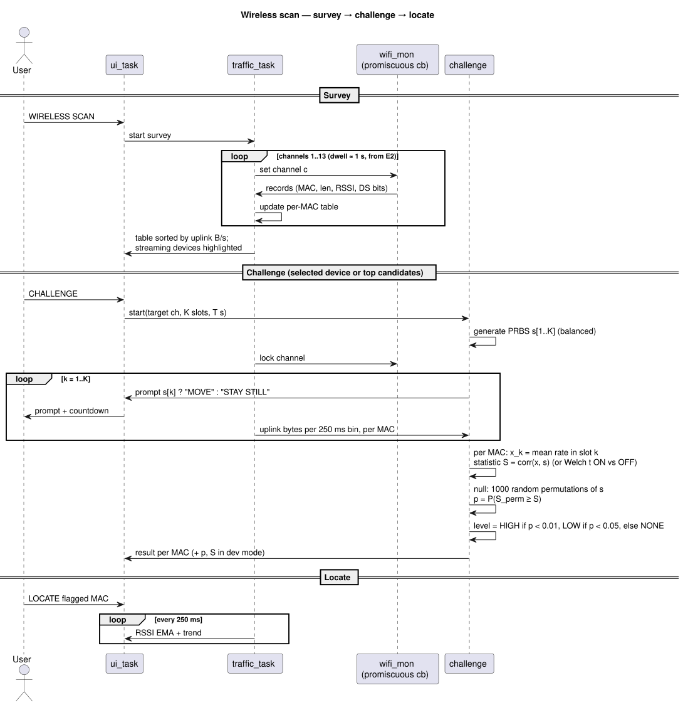
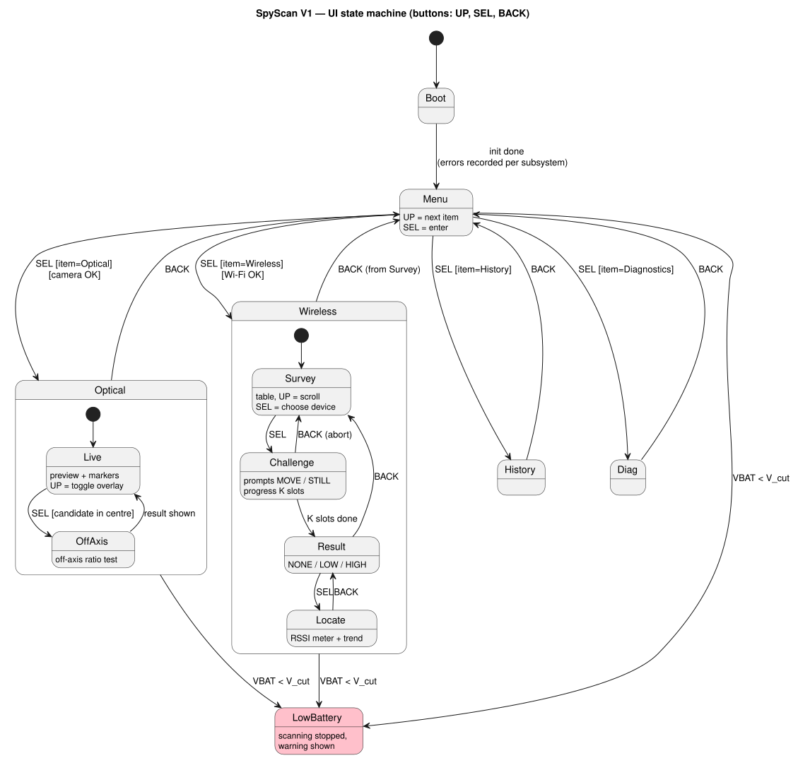

# SpyScan V1 — Architecture (draft 0.1)

Status: **pre-hardware draft**, 2026-10-02. Everything marked [A] must be verified once the parts arrive. The pin map **must be checked against the actual board schematic** before wiring.

Diagram sources are PlantUML files in `diagrams/`; rendered PNG/SVG files are in `img/`. To re-render: `java -jar plantuml.jar -tsvg -o ../img diagrams/*.puml`.

---

## 1. Hardware structural diagram

### 1.1 Key hardware decisions

| # | Decision | Reason | Alternatives considered |
|---|---|---|---|
| HW-1 | One ESP32-S3 with ≥ 8 MB PSRAM handles both modes; the modes run **one at a time** in V1. | It has a camera interface (DVP), a 2.4 GHz radio with promiscuous mode and PSRAM for QVGA frame buffers. One chip means one firmware, lower power and a faster boot. | ESP32-S3 + Raspberry Pi: more power, a longer boot and a second OS. Two ESP32-S3s connected by UART: kept as a fallback (D2), decided by E4. |
| HW-2 | ILI9341 2.4" 240×320 SPI display | Large enough for a QVGA preview at 1:1 (320×240 in landscape). It is supported by the Wokwi simulator and by ESP-IDF `esp_lcd`. | ST7789 1.9–2.0": smaller, and not in our simulator. OLED: no colour preview. |
| HW-3 | The LEDs are powered from the **5 V bus**, each with its own 150 Ω resistor and switched low-side by an AO3400A. | 5 V gives a stable LED current (~20 mA) as the battery discharges. The MOSFET is fully on at V_GS = 3.3 V [F: the AO3400A datasheet specifies R_DS(on) at V_GS = 2.5 V]. GPIOs cannot source 120 mA. | Powering the LEDs from VBAT: the current would drift by about 30 % over a discharge. A constant-current driver IC: more parts, not needed at this current. |
| HW-4 | The power path is a 1S Li-Po feeding an IP5306-type charge+boost module, giving 5 V to the board's 5 V pin and to the LEDs. | One module handles USB-C charging, battery protection and the 5 V boost. Most S3 camera boards regulate 3.3 V from 5 V. | TP4056 + MT3608: two modules (bought as a fallback). A buck-boost straight to 3.3 V: more efficient, but bypasses the board's regulator; a future option. |
| HW-5 | The display backlight is tied to 3.3 V (always on). | Saves a GPIO; the power impact is already counted in the budget. | PWM dimming: added later if a pin is free. |

### 1.2 Interface table

| Peripheral | Bus / signal | ESP32-S3 resource | Rate / timing |
|---|---|---|---|
| OV2640 | DVP 8-bit + PCLK/HREF/VSYNC; SCCB (I²C); XCLK | LCD_CAM peripheral + GDMA; I²C; LEDC (XCLK) | XCLK 20 MHz; QVGA (320×240) grayscale; fps [A] 25–30 |
| ILI9341 | SPI (SCLK, MOSI, CS, DC) | SPI2 (FSPI) via GPIO matrix + DMA | 40 MHz [A: this exceeds the datasheet's nominal serial write cycle; it is widely used in practice; fallback 20–26 MHz] → a 320×240 RGB565 frame (150 KB) in ≈ 31 ms |
| LED groups | GPIO → AO3400A gate (100 Ω series, 100 kΩ pull-down) | GPIO, toggled by cam_task on VSYNC | switching ≪ 1 ms |
| Buttons | GPIO, active low, internal or external pull-up | GPIO ISR (any edge) + 5 ms esp_timer debounce | — |
| Battery | 100k/100k divider → ADC | ADC1_CH0, oneshot + curve-fitting calibration | 1 Hz |
| Buzzer (C) | LEDC PWM → transistor | LEDC channel | 2–4 kHz |
| Dev/USB | USB-Serial or USB-Serial/JTAG | UART0 (CH343 bridge) or native USB | 921 600 baud or USB FS |
| Wi-Fi monitor | internal | esp_wifi promiscuous callback | up to a few thousand frames/s [A] |

### 1.3 Draft pin map

Based on the common **ESP32-S3-EYE-style camera mapping** used by Freenove-type S3 camera boards [A — verify against the bought board].

| Function | GPIO | Notes |
|---|---|---|
| CAM XCLK / SIOD / SIOC | 15 / 4 / 5 | camera, fixed by the board |
| CAM D0..D7 (Y2..Y9) | 11, 9, 8, 10, 12, 18, 17, 16 | camera, fixed by the board |
| CAM VSYNC / HREF / PCLK | 6 / 7 / 13 | camera, fixed by the board |
| Octal PSRAM | 35, 36, 37 | **do not use** |
| USB D− / D+ | 19 / 20 | **do not use** |
| UART0 TX / RX | 43 / 44 | console / dev mode |
| **LCD SCLK** | 47 | |
| **LCD MOSI** | 21 | |
| **LCD CS** | 41 | |
| **LCD DC** | 42 | |
| LCD RST | — | tied to 3.3 V through 10 kΩ; software reset (SWRESET 0x01) |
| **LED_AXIS** (on-axis ring) | 2 | MOSFET gate |
| **LED_OFF** (off-axis pair) | 14 | MOSFET gate |
| **BTN_UP / BTN_SEL / BTN_BACK** | 38 / 39 / 40 | these pins serve the SD slot on some boards; the SD card is unused in V1 |
| **VBAT_SENSE** | 1 | ADC1_CH0 |
| BUZZER (C) | 3 | strapping pin (JTAG source select); safe as an output after boot [A] |
| Spare | 0 (BOOT button), 45, 46 (strapping), 48 (on-board RGB LED on some boards) | avoid unless needed |

The same GPIO numbers are used in the **Wokwi simulation** (`sim/wokwi/`), so the simulated wiring is the real wiring.

### 1.4 LED driver calculation

- Red LED: V_F ≈ 2.0–2.2 V at 20 mA [A, from the bought LED's datasheet].
- R = (5.0 − 2.1 − V_DS) / 0.020 ≈ 145 Ω → **150 Ω** (≈ 19 mA). P_R = 0.019² × 150 ≈ 54 mW, so 0.125 W resistors are fine.
- The on-axis group (6 LEDs) draws ≈ 115 mA. AO3400A: R_DS(on) ≈ 50 mΩ at V_GS = 2.5 V [F, datasheet], so V_DS ≈ 6 mV and the dissipation is negligible.
- Gate: 100 Ω series resistor (limits the GPIO edge current) and a 100 kΩ pull-down so the LEDs stay off while the GPIO floats at boot.
- E1 may show that more optical power is needed. Pulsed operation above 20 mA is then possible within the LED datasheet's pulse rating, because the duty cycle is ≤ 50 %.

### 1.5 Power budget (estimate, `tools/power_budget.py`)

| Mode | I(3.3 V) mA | I(LED, 5 V) mA | P(5 V) W | I(battery) mA | Life h |
|---|---|---|---|---|---|
| Optical | 155 | 60 | 1.07 | 342 | 4.7 |
| Wireless | 190 | 0 | 0.95 | 302 | 5.3 |
| Idle / menu | 73 | 0 | 0.36 | 116 | 13.8 |
| **Mixed 45/45/10** | | | | **301** | **5.3** |
| Pessimistic (+50 %) | | | | 452 | 3.5 |

Assumptions:
- 2000 mAh × 80 % usable.
- Boost efficiency 85 %.
- Load currents are typical datasheet-class figures, every one marked [A] in the script.

**Conclusion:** the NR-P6 target (≥ 1.5 h) has a margin of ≥ 2.3× even in the pessimistic case. Measured values will replace the estimates in AT-10.

Other checks:
- **LDO dissipation:** (5 − 3.3) V × 0.19 A ≈ 0.32 W in the on-board LDO, which is acceptable but noticeable. A 3.3 V buck-boost would remove this loss (future option).
- **Peaks:** Wi-Fi TX bursts (≈ 300–350 mA at 3.3 V) only occur during the optional AP scan. The module's 2.1 A output covers them, with 470 µF of bulk capacitance at the board's 5 V input.
- **Low-battery cut-off:** V_cut = 3.4 V at the cell, measured through the divider: ADC input = 1.7 V, within ADC range at 12 dB attenuation.

---

## 2. Software structural diagram

### 2.1 Layering rules

1. **The detection logic is hardware-free.** `optical_pipeline`, `challenge` and `ui_fsm` are pure C with no ESP-IDF calls. This lets them be unit-tested on a PC and reused in the Wokwi simulation.
2. **Drivers own peripherals.** Only `cam_drv` touches the camera and only `wifi_mon` touches esp_wifi; there is no cross-access.
3. **`board_pins.h` is the single source of the pin map** (the same file is used by the simulation).
4. **`app_ctrl` arbitrates the radio and camera.** It guarantees the mode exclusivity of V1 and powers the camera down in wireless mode.

## 3. Real-time structure (FreeRTOS)

**Why FreeRTOS and not bare-metal:**
- Three independent timing domains have to coexist: camera frames (~33 ms), Wi-Fi packets (asynchronous, bursty, µs-scale callback) and the UI (≤ 200 ms response).
- ESP-IDF's Wi-Fi stack already runs on FreeRTOS, so a bare-metal super-loop is not an option on this platform. FreeRTOS gives priorities, core pinning and queues at no extra cost.

| Task | Core | Prio | Period / trigger | Budget [A, to be measured] |
|---|---|---|---|---|
| cam_task | 1 | 6 | each VSYNC (~33–40 ms) | < 2 ms CPU (DMA does the transfer) |
| opt_task | 1 | 5 | per ON/OFF pair | ≈ 77k px × ~10 ops ≈ 0.8 M ops → **< 5 ms** at 240 MHz |
| Wi-Fi callback | 0 | (driver) | per packet | < 10 µs: copy a 16-byte record into the ring buffer |
| traffic_task | 0 | 5 | ring-buffer data + 250 ms bin tick | table of ≤ 64 MACs |
| challenge (in traffic_task) | 0 | 5 | end of a challenge | 1000 permutations × 64 MACs × 12 slots ≈ 0.8 M ops → < 10 ms |
| ui_task | 0 | 4 | events + ≤ 20 Hz redraw | full redraw ≈ 31 ms of SPI DMA (partial redraws preferred) |
| log_task | 0 | 2 | queue | best effort |

Watchdog: the Task WDT subscribes cam_task, opt_task, traffic_task and ui_task with a 5 s timeout (NR-R3).

### 3.1 Optical timing (critical path)

- The OV2640 has a **rolling shutter** [F]. Rows of a frame are exposed at different times, so an LED toggled at VSYNC illuminates part of the next frame. The baseline therefore uses a **4-frame cycle** (ON-transition, ON, OFF-transition, OFF) and discards the transition frames.
- At 25 fps that gives **6.25 pairs/s**, which meets NR-P3 (≥ 5 Hz) with little margin [A].
- If E1 shows that a short exposure plus toggling during vertical blanking gives clean frames, the cycle shortens to 2 frames (12.5 pairs/s).
- AEC, AGC and AWB are locked for the scan (FR-O2). Exposure is set once from the OFF frame's histogram when the scan starts.

### 3.2 Wireless challenge timing

- **Survey:** 13 channels × ≈ 1 s dwell ≈ 13 s (NR-P4 ≤ 15 s). The dwell time is to be tuned in E2.
- **Challenge:** K = 12 slots × T = 5 s = 60 s (NR-P5). These are initial values to be chosen by the Python simulation (next step) and confirmed in E2.
- **Statistic:** the correlation between the per-slot uplink rate and the ±1 stimulus.
- **Threshold:** set by a permutation test, p < 0.01 for HIGH (FR-W6). It is not an arbitrary constant: the false-alarm rate is fixed by construction.
- With K = 12 balanced slots there are C(12,6) = 924 distinct permutations, so the smallest achievable p is ≈ 0.001. That is enough for p < 0.01.
- **Design constraint (derived, and confirmed in the PC simulation `sim/test`): K ≥ 10.** For K = 8, the smallest possible p is 1/70 ≈ 0.014 > 0.01, so a HIGH result is mathematically impossible.
- **Source vs. viewer (new, from the simulation):** a phone watching the camera's live stream also correlates with the stimulus, because its uplink TCP ACKs follow the downlink stream. The result therefore adds the **direction feature**:
  - correlated and uplink > downlink → *camera-like SOURCE*;
  - correlated and downlink-dominant → *viewer/relay of a stream*.
  This is hypothesis **H4**, to be tested in E2.

## 4. User interface

- The UI is a pure state machine (`ui_fsm.c`). Inputs are button and result events; outputs are draw commands.
- The state machine runs unchanged in the Wokwi simulation and on the device.

## 5. Risks and open questions

| # | Risk / unknown | Impact | Resolved by |
|---|---|---|---|
| R1 | The bought board's pin map differs from the draft | rewiring | check the schematic on arrival; edit `board_pins.h` |
| R2 | The OV2640 fps or rolling shutter limits the pair rate below 5 Hz | NR-P3 | E1; fallback is a lower resolution (QQVGA) |
| R3 | IP5306 auto-off at low load / boost not starting without a key press | power | bench test; fallback is TP4056 + MT3608 |
| R4 | Retroreflection too weak at 1 m with 6 × 20 mA | NR-P1 | E1; fallbacks are pulsed overdrive and narrower-angle LEDs |
| R5 | The camera's traffic does not respond to the stimulus | method 2 | E2; fallback is the light ON/OFF stimulus |
| R6 | The test camera uses 5 GHz only | method 2 | buy a 2.4 GHz model (check the listing) |

## 6. Simulation and verification without hardware

- **`sim/wokwi/`**: Wokwi HMI simulation (ESP32-S3 + ILI9341 + buttons + LEDs) running the real `ui_fsm.c` and `challenge.c` with synthetic data sources. See `sim/README.md`.
- **`sim/test/`**: PC unit tests of the hardware-independent modules: 22 UI transition checks and a Monte-Carlo test of the challenge detector.
- **`tools/power_budget.py`**: reproducible power budget (Section 1.5).
