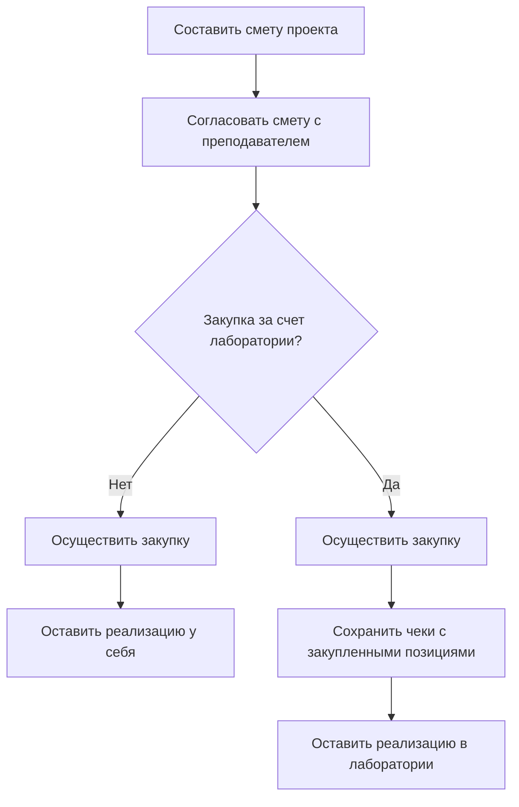

# Проектный трек — Встроенные системы (ИТМО)

> **Дисциплина:** Встроенные системы  
> **Поток:** 1.3  
> **Преподаватель трека:** Зиновичев Егор Станиславович  
> **Email:** ezinovichev@itmo.ru  
> **Telegram:** @scarletshroud

---

## Содержание

1. [Структура трека](#структура-трека)
2. [Техническое задание](#техническое-задание)
3. [Как осуществляются закупки?](#как-осуществляются-закупки)
4. [Описание архитектуры проекта](#описание-архитектуры-проекта)
5. [Промежуточная демонстрация работы проекта](#промежуточная-демонстрация-работы-проекта)
6. [Разработка отчета](#разработка-отчета)
7. [Участие в ПИКТ-Фест](#участие-в-пикт-фест)
8. [Защита проекта](#защита-проекта)
9. [Варианты проектов](#варианты-проектов)
10. [Как организована практическая работа?](#как-организована-практическая-работа)
11. [Полезная литература](#полезная-литература)

---

## Структура трека

1. Согласование проекта
2. Техническое задание (10 баллов)
3. Описание архитектуры проекта (15 баллов)
4. Промежуточная демонстрация работы проекта (15 баллов)
5. Разработка отчета (20 баллов)
6. Защита проекта (10 баллов)

> Участие в **ПИКТ-Фест**\* приравнивается к успешной защите проекта

\*Название конкурса "ПИКТ-Фест" сейчас находится на согласовании и может измениться.

---

## Техническое задание

### ИТМО

**Структура технического задания:**

1. **Общие сведения** (цель и краткое описание проекта, команда и роли исполнителей)
2. **Технические требования** (функциональные и нефункциональные требования)
3. **Требования к документации** (схемы, описание ПО, руководство пользователя)
4. **Технико-экономические показатели** (смета проекта и перечень комплектующих)
5. **Стадии и этапы разработки** (описать обязанности исполнителей по этапам)
6. **Порядок контроля и приемки** (что будете выносить на демонстрацию проекта при защите?)
7. **Ссылки на источники** (источники, которые использовались в ходе составления ТЗ)

**На данном этапе необходимо:**

- Сформировать репозиторий проекта и прислать его преподавателю
- Составить предварительную смету для закупок
- Определиться — реализуете проект за счет университета или самостоятельно?

> **Шаблон ТЗ**

---

## Как осуществляются закупки?

---

## Описание архитектуры проекта

### ИТМО

На данном этапе необходимо подготовить:

#### Структурную схему аппаратной части проекта

- Как подключаются модули?
- Какие интерфейсы для этого нужны?
- Расчет схемы по питанию и энергопотреблению

#### Структурную схему программного обеспечения

- Какие программные модули существуют?
- Как они взаимодействуют между собой?
- Какие внешние модули используют?

#### 3D-модель корпуса изделия для дальнейшей печати (если требуется)

**Полезные инструменты:**

| Инструмент | Назначение |
|---|---|
| **PlantUML** | Создание UML-диаграмм с помощью написания кода |
| **FreeCad** | 3D-моделирование |
| **OpenScad** | 3D-моделирование при помощи написания кода |
| **BambuStudio** | Слайсер 3D-моделей для печати на лабораторном принтере |
| **Fritzing** | Инструмент для создания схем на базе популярных микроконтроллеров |
| **Altium Designer** | САПР для печатных плат |

---

## Промежуточная демонстрация работы проекта

**Цель** — обсудить текущее состояние проекта, выявить проблемные места и договориться о доработках до даты защиты.

### Рекомендуемый сценарий

1. Показать устройство или стенд в сборке
2. Запустить ключевую функцию проекта
3. Показать обработанные данные
4. Обозначить дальнейший план доработки

---

## Разработка отчета

**Отчет предоставляется во время защиты проекта со следующей структурой:**

1. Титульный лист
2. Описание проекта
3. Техническое задание
4. Описание архитектуры проекта
5. Краткое руководство по эксплуатации проекта
6. Описание хода выполнения работы
7. Описание результатов проведенной работы (+ дальнейшие перспективы развития проекта)
8. Используемые источники

---

## Участие в ПИКТ-Фест

### ИТМО

**Конкурс проводится в первой половине декабря**

### Что дает участие?

1. Максимальный балл за защиту проекта
2. Обратная связь от преподавателей, студентов и других команд
3. Возможность показать проект для портфолио
4. Для призеров — дополнительные возможности по поступлению в магистратуру

### Как принять участие?

1. Добиться работоспособности устройства
2. Связаться с преподавателем для уточнения порядка участия
3. Подать заявку через форму с указанием темы проекта и команды участников
4. Подготовить презентацию проекта для демонстрации

---

## Защита проекта

**Защита проектов проходит в дату зачета в офлайн формате**

| Этап | Описание |
|---|---|
| **Презентация** | Рассказываем о проекте, каждый участник кратко описывает свой вклад в работу и полученный результат |
| **Демонстрация** | Показываем работоспособность проекта на конкретном сценарии применения |
| **Ответы на вопросы** | Обсуждаем инженерные решения, ограничения, проблемы и дальнейшие улучшения |

### На что обратить внимание при подготовке к защите?

Понятная постановка цели, демонстрация целевой функции, аргументация принятых решений, прозрачное распределение вклада в команде и честное описание существующих ограничений.

---

## Варианты проектов

### Направления

- Умный дом и бытовая автоматизация
- TinyML и интеллектуальные устройства
- Робототехника
- Хобби/Мультимедийные проекты
- Измерительные устройства
- Человеко-машинные интерфейсы

### Варианты

1. Дешифратор фраз домашних животных
2. Умный скворешник для птиц
3. Умная кормушка для животных
4. Умный шкаф для выдачи плат студентам
5. Умное растение с AI-агентом
6. Портативная камера с AI-фильтром
7. Компактный AI-ассистент
8. Домашняя сигнализация
9. Система контроля протечек
10. Монитор качества воздуха
11. Портативная метеостанция
12. Музыкальный синтезатор/инструмент
13. Портативная игровая консоль
14. Робот для прохождения лабиринта Micromouse
15. Перчатка для управления устройствами

---

## Как организована практическая работа?

**Проходит на базе Лаборатории Компьютерной Инженерии в аудитории 1423**

### В рамках работы над проектами

- Обсуждение и помощь в решении проблем по проектам
- Инструменты для создания проектов: расходники, электронные модули, паяльная станция, 3D-принтер

### В рамках дальнейшего взаимодействия с лабораторией

- Возможность прохождения учебной, преддипломной и производственных практик
- Научное руководство для написания ВКР
- Возможность дальнейшего сотрудничества в рамках проектной деятельности в лаборатории

---

## Полезная литература

### Программирование на языке СИ и ASM

1. *The C Programming Language. 2nd Edition.* Brian Kernighan
2. *Low-level programming.* Igor Zhirkov
3. *Программирование на языке Ассемблера RISC-V.* Стивен Смит
4. *Modern C, Third Edition: Covers the C23 standard*

### Архитектура компьютера и цифровая схемотехника

1. *Цифровая схемотехника и архитектура компьютера.* Дэвид М. Хэррис и Сара Л. Хэррис
2. *Computer Architecture: A Quantitative Approach.* J.L. Hennessy, D.A. Patterson
3. *Open Circuits: The inner beauty of electronic components* (Для эстетического удовольствия)

### Материалы по встраиваемым системам

1. *Аппаратные и программные средства встраиваемых систем.* А.О. Ключев, Д.Р. Ковязина, П.В. Кустарев, А.Е. Платунов
2. *Making Embedded Systems.* Elecia White
3. *Архитектура встраиваемых систем.* Даниэле Лакамера
4. *The Definitive Guide to ARM Cortex-M0 and Cortex-M0+ Processors. Second Edition.* Joseph Yiu
5. *Programming Embedded Systems in C and C++.* Michael Barr, Anthony Massa

> Также основной литературой при работе с встраиваемыми системами являются **datasheet'ы** и техническая документация на используемые микросхемы и модули:
> - К примеру, для **STM32F427xx STM32F429xx**
> - На популярный **ESP32**

В дополнение можно порекомендовать данный интернет-ресурс, там можно найти много полезной информации и статей по работе с микроконтроллерами — [http://easyelectronics.ru/](http://easyelectronics.ru/)

---

*Конец документа*